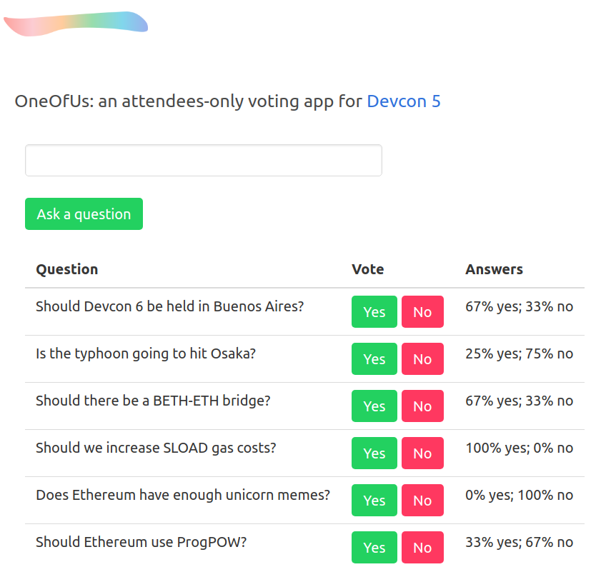

# OneOfUs: an anonymous survey/voting dApp built on POAP and Semaphore built for DevCon 5

OneOfUs lets you ask questions to attendees of [Devcon 5](https://devcon.org/),
and lets them, and only them, reply anonymously.

## How it works

Each attendee at Devcon 5 will receive a non-fungible
[Proof of Attendance Token](http://poap.xyz) (POAP). We assume that only Devcon
5 attendees own POAP tokens associated with this event.

Attendees can register themselves to the contract as long as they own a Devcon
5 POAP token. When they wish to respond to a question, they can use OneOfUs to
generate a proof of their initial registration. This proof does not reveal
their identity, but only their membership in the set of registered identities.

For my workshop at Devcon, posting questions and answers are done entirely
off-chain, so that participants won't have to pay any gas except for identity
registration. The smart contract, however, already supports the ability for
registered users to post and answer questions.

Like the smart contract which keeps track of nullifier hashes and rejects
double signalling, the off-chain backend prevents double-voting.

The contract requires users to pay extra ETH when they as a question, and these
funds are used to pay [Surrogeth](https://github.com/lsankar4033/surrogeth/)
relayers to submit proofs on behalf of users when they wish to answer questions.

Under the hood, OneOfUs uses
[Semaphore](https://github.com/appliedzkp/semaphore), a zero-knowledge signalling
gadget. Read more about it [here](https://medium.com/coinmonks/to-mixers-and-beyond-presenting-semaphore-a-privacy-gadget-built-on-ethereum-4c8b00857c9b).

Please note that the version of Semaphore that OneOfUs uses is outdated. If you
wish to implment a voting app in Semaphore, please use the latest version.
